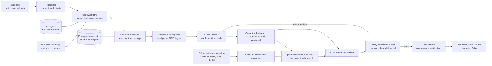

# Medical Report Explainer: Product and System Architecture

**Decision date:** 15 August 2026  
**Stage:** Buildathon architecture, with a safe path toward production  
**Working descriptor:** Medical Report Explainer  
**Primary user promise:** “Understand what your reports and doctor wrote, in language you are comfortable with, and prepare better questions for your doctor.”

## 1. Executive decision

Build a **medical-report explanation system**, not an autonomous diagnosis or treatment agent.

The system may:

- extract facts that are actually present in uploaded reports and prescriptions;
- explain those facts in plain language;
- compare current and past values when the units and tests are comparable;
- repeat and simplify instructions that a doctor wrote;
- show the source page for every patient-specific statement;
- help the user prepare questions for a registered medical practitioner (RMP).

The system must not:

- diagnose a condition;
- prescribe, change, stop, or recommend a medicine;
- turn population prevalence into a claim about an individual;
- interpret CT, MRI, X-ray, ultrasound, pathology-slide, or other diagnostic pixels with a general vision model;
- use live internet search with patient-identifiable context;
- silently guess unreadable doses, values, units, names, dates, or reference ranges.

This is not only cautious wording. India’s Telemedicine Practice Guidelines say AI/ML telemedicine platforms cannot counsel patients or prescribe medicines; the final counseling or prescription must come directly from an RMP. That clause expressly covers telemedicine platforms, so counsel should confirm how it applies to a standalone report explainer, but it is the correct conservative boundary. India also regulates software whose intended use includes diagnosis, prevention, monitoring, or treatment as a medical device. Product behavior, marketing, and intended use matter more than a disclaimer. See the [Telemedicine Practice Guidelines](https://esanjeevani.mohfw.gov.in/assets/guidelines/Telemedicine_Practice_Guidelines.pdf) and the [CDSCO medical-device definition and current software guidance](https://www.cdsco.gov.in/opencms/opencms/en/Medical-Device-Diagnostics/Medical-Device-Diagnostics/). Do not rely on the 2023 NMC RMP conduct regulations for this point; the [NMC regulations page](https://www.nmc.org.in/rules-regulations-nmc/) records that those regulations were placed in abeyance.

### Recommended model decision today

Use a deterministic workflow with bounded model roles. Do not build a free-form agent swarm.

| Work | Buildathon default | Why | Production condition |
|---|---|---|---|
| PDF/image OCR and layout | Sarvam Vision | Strong Indic document coverage; ₹0.5/page; page-level bounding boxes | Synthetic/de-identified demo only unless an enterprise DPA explicitly permits health data, disables training, and defines retention/residency |
| Text-PDF extraction | Local PDF parser first | Fast, cheap, private, preserves exact text | Always prefer local extraction when text is available |
| Fact and prescription structuring | GPT-5.6 Terra, medium effort, strict JSON schema | Good capability/cost balance; critical fields still go through deterministic validation and user review | Use an approved zero-retention or healthcare-ready contract before real health data |
| Final five-point explanation | GPT-5.6 Sol, medium effort; high only for conflicted cases | Current strongest OpenAI health model; one high-quality call costs little relative to safety risk | Keep only if it wins the local clinician-reviewed evaluation |
| Claim verification | Deterministic checks plus a fresh GPT-5.6 Sol entailment-only pass | Catches numeric, citation, and unsupported-claim errors without adding another PHI processor | A second independently evaluated model is useful only under the same privacy and quality controls |
| Grounded follow-up Q&A | GPT-5.6 Terra, medium effort | Lower latency and cost; receives only confirmed facts and approved evidence | Escalate conflicts to Sol; never silently fall back to a weaker model |
| Indic speech-to-text | Sarvam Saaras v3 | Designed for Indian languages, accents, and code-mixing | Same enterprise health-data contract requirement as above |
| Indic translation and speech | Sarvam Translate and Bulbul v2 | v2 is the stable buildathon choice; v3 is beta | Evaluate v3 separately; verify with a clinician-reviewed glossary; never translate an unverified clinical draft |
| Patient-specific visuals | React/SVG components, no image model | Exact, accessible, testable, calm, and unable to invent anatomy or findings | Keep deterministic in production |
| Challenger model | Gemini 3.7 Flash paid tier | Very strong cost/latency profile and stable multimodal/PDF support | Run in shadow evaluation on de-identified cases; do not route PHI to two vendors by default |

This is a starting configuration, not a claim that one provider is universally best. Current public medical leaderboards do not yet compare all of GPT-5.6 Sol, Gemini 3.7 Flash, and Claude Sonnet 5 on this exact workflow. Provider benchmarks are useful signals, not deployment evidence. A local report-extraction and explanation evaluation must decide the final routing.

## 2. Product boundary and user experience

### 2.1 Rename the risky parts

Avoid “AI medical analysis,” “diagnosis,” “what you have,” and “recommended treatment.” Use:

- “Your report, explained”
- “What the report says”
- “What changed since the earlier report”
- “Instructions written by your doctor”
- “Questions you may want to ask your doctor”
- “This report does not contain enough information to determine that”

### 2.2 Revised four-screen flow

#### Screen 1: About you and consent

Collect:

- preferred name for display;
- age or age band;
- preferred language: English, Hindi, Tamil, Kannada, or Marathi;
- current symptoms, optional;
- known history, optional;
- voice input, optional;
- separate, clear consent for document processing and retention.

Do not send the name to a model. Store identity separately from the clinical case. Use a random case ID in model payloads.

For the buildathon, restrict use to adults. A real minor flow needs verified guardian consent and product-specific legal review. The final DPDP Rules were published in November 2025 with phased commencement; many core requirements take effect 18 months later, in May 2027. The older SPDI Rules remain relevant in the interim and expressly cover medical records and health history. Build to the full consent, purpose-limitation, rights, and security standard now. See the [final DPDP Rules and enforcement timeline](https://www.meity.gov.in/documents/act-and-policies/digital-personal-data-protection-rules-2025-gDOxUjMtQWa) and the [SPDI Rules 2011](https://meity.gov.in/sites/upload_files/dit/files/GSR313E_10511%281%29.pdf).

#### Screen 2: Upload documents

Accept up to ten PDFs or images and let the user label each file:

- current medical report;
- past medical report;
- current prescription;
- past prescription;
- other doctor-provided note.

Do not accept DICOM pixels in the buildathon version. A later version can accept the signed radiology report or an encapsulated PDF extracted from a DICOM study.

#### Required interstitial: Review extracted information

This step is essential even if it is not counted as a marketing screen.

Show:

- patient name detected in each document, to catch mixed-patient uploads;
- report date and laboratory/provider;
- test value, unit, printed reference range, and printed flag;
- medicine, dose, route, frequency, timing, and duration exactly as written;
- a thumbnail and page link for each field;
- low-confidence fields in a neutral review state.

The user confirms or corrects critical fields. The system must not generate the final explanation until unresolved dose, unit, decimal, patient-identity, or date conflicts are reviewed.

#### Screen 3: Your report, explained

Render five stable cards:

1. **What these documents cover** — document types and dates.
2. **Important findings written in the reports** — no inferred diagnosis.
3. **What changed over time** — only comparable tests and units.
4. **Your doctor’s written instructions** — literal restatement with source links.
5. **Questions for your next doctor visit** — questions, not recommendations.

Every patient-specific sentence has a source chip such as “Blood report · page 2.” Selecting it opens the exact source region. If a statement is general education, show a separate guideline/evidence citation.

#### Screen 4: Ask about these documents

Support text first. Add push-to-talk voice after the text path is reliable.

The answer policy has three result types:

- **Document fact:** answer from a confirmed fact and cite its page.
- **Approved general explanation:** answer from the reviewed evidence corpus and cite it.
- **Cannot determine:** explain what the documents do not establish and offer a question for the doctor.

Questions such as “Should I stop this tablet?”, “What medicine should I take?”, or “Do I have cancer?” must not trigger treatment or diagnosis. The system can quote the uploaded doctor’s instruction and help phrase a follow-up question.

## 3. Architecture at a glance



The critical design rule is **facts first, prose last**. Models do not pass unconstrained prose to one another. They exchange typed, versioned records with source references.

## 4. System layers

### Layer 1: Experience

- Next.js web application.
- Mobile-first, accessible, large type, simple language.
- Text and optional push-to-talk input.
- Document/source viewer.
- Extracted-fact review.
- Deterministic charts and medication cards.

### Layer 2: Trust edge

- authentication or anonymous short-lived case token;
- clear consent and retention choice;
- age gate for the buildathon;
- upload URL signing;
- MIME sniffing and extension mismatch rejection;
- file, page, pixel, and request limits;
- tenant and case authorization on every read;
- rate limiting and abuse protection.

### Layer 3: Workflow orchestration

Use an explicit state machine, not autonomous agent planning.

Suggested states:

`DRAFT → UPLOADED → SCANNED → EXTRACTED → NEEDS_REVIEW → CONFIRMED → ENRICHED → DRAFTED → VERIFIED → READY`

Failure states:

`REJECTED_FILE`, `EXTRACTION_FAILED`, `SAFETY_FAILED`, `EXPIRED`, `DELETED`.

Each transition is idempotent. Persist the input hash, prompt version, model snapshot, schema version, output hash, token use, and non-sensitive status. A retry must not create a second case or duplicate claims.

### Layer 4: Document intelligence

- local PDF text extraction first;
- OCR only for scanned pages or low text coverage;
- page images normalized for rotation, contrast, and resolution;
- layout blocks, tables, and bounding boxes preserved;
- document type and date classification;
- strict extraction schema for observations and medication instructions;
- low-confidence and cross-document conflict detection.

### Layer 5: Clinical facts and evidence

- canonical, FHIR-aligned fact graph;
- terminology normalization without replacing original text;
- exact report reference ranges;
- time-series matching only when analyte, unit, specimen, and method are compatible enough;
- hybrid retrieval from an approved, versioned corpus;
- source provenance for both patient facts and general education.

### Layer 6: Explanation and safety

- bounded synthesis call;
- claim-to-source entailment check;
- numeric and unit validation in code;
- prescription “as written” policy;
- unsupported advice/diagnosis classifier;
- clinician-reviewed urgent-symptom banner rules;
- localization only after the source-language explanation passes.

### Layer 7: Data and operations

- encrypted object storage with short retention;
- Postgres for case state, facts, consent, audit, and evidence metadata;
- `pgvector` plus Postgres full-text search for approved evidence;
- Postgres-backed job queue such as `pg-boss` for the buildathon;
- OpenTelemetry metrics and traces with content redaction;
- model/provider adapters and pinned versions;
- deletion workflow across database, object store, caches, and vendor files.

## 5. Bounded agents and contracts

“Agent” means a component with one narrow responsibility, one input schema, and one output schema. Only the Q&A component is interactive. None can independently browse the public internet or change patient data.

### 5.1 Intake normalizer

**Model:** none; Sarvam Saaras v3 only when voice is used.  
**Input:** user-entered symptoms and history.  
**Output:** original transcript, language, and user-confirmed text.  
**Rule:** never silently rewrite a symptom. Show the transcript before submission.

### 5.2 Document extractor

**Model:** local parser, Sarvam Vision when OCR is needed, then GPT-5.6 Terra for typed structuring.  
**Input:** sanitized pages only.  
**Output:** `Document`, `SourceSpan`, `Observation`, and `MedicationInstruction` candidates.  
**Tools:** none. No web, database, or action tools.  
**Security:** all document text is untrusted data. Instructions printed inside a PDF cannot alter the system prompt or call tools.

### 5.3 Fact reconciler

**Model:** deterministic code first; Terra only for terminology candidates.  
**Input:** extraction candidates from all documents.  
**Output:** comparable groups, conflicts, duplicates, and review tasks.  
**Rule:** preserve the original label and value. A normalized code is additive, never a replacement.

### 5.4 Evidence retriever

**Model:** embeddings plus deterministic hybrid retrieval.  
**Input:** normalized concepts with age/context filters.  
**Output:** a small set of approved evidence passages with version, jurisdiction, date, and reviewer status.  
**Rule:** it cannot query the open internet. It searches only the reviewed internal corpus.

### 5.5 Explanation synthesizer

**Model:** GPT-5.6 Sol.  
**Input:** confirmed facts, printed reference ranges, relevant doctor instructions, and retrieved approved evidence.  
**Output:** exactly five typed cards plus claim records.  
**Rule:** every patient claim must reference one or more `SourceSpan` IDs. Every general educational claim must reference an `EvidencePassage` ID.

### 5.6 Safety and claim verifier

**Model:** code checks plus a separate, fresh Sol verification request.  
**Input:** proposed claims and only the sources cited for those claims.  
**Output:** `supported`, `contradicted`, `insufficient`, or `unsafe`, with a reason code.  
**Rule:** the verifier cannot rewrite a failed claim. It rejects it and sends the case back to synthesis or review.

Deterministic checks include:

- every numeric token in a claim exists in its cited source;
- unit and decimal match the confirmed fact;
- printed high/low/normal status is not reversed;
- medication dose/frequency/duration match exactly;
- trend comparison uses compatible units;
- no claim uses “diagnosis,” “you have,” “take,” “stop,” “increase,” “decrease,” or an equivalent prohibited pattern unless quoting a doctor and clearly labeled as a quote/restatement;
- all five cards are present and within length limits.

### 5.7 Localizer

**Model:** Sarvam Translate with a versioned medical glossary; Terra back-translation check for critical terms; Bulbul v2 for spoken output.  
**Input:** only verified source-language cards.  
**Output:** localized cards mapped one-to-one to the same claim and citation IDs.  
**Rule:** localization cannot introduce a new claim. Medicine names, dose strings, units, and source values remain protected tokens.

### 5.8 Q&A agent

**Model:** GPT-5.6 Terra; Sol escalation for contradictions or multi-document questions.  
**Input:** the question, relevant confirmed facts, relevant approved evidence, conversation summary, and the answer policy.  
**Output:** answer type, concise answer, citations, uncertainty, and optional doctor question.  
**Tools:** case-scoped retrieval only. No live web, ordering, scheduling, messaging, prescription, or external action tools.

## 6. Model research and selection

### 6.1 How to read the comparison

The following facts come from current provider documentation, their hosted `llms.txt` indexes, Context7 documentation snapshots, and the current MedHELM project. Provider-reported benchmarks are not directly comparable when prompts, graders, effort, and datasets differ. [MedHELM](https://medhelm.org/) is broader and more independent, but its public leaderboard does not yet cover every current model or this exact report-explanation task.

For that reason, the correct decision process is:

1. shortlist on capability, privacy, price, stability, and developer fit;
2. run the same de-identified, clinician-annotated cases through each candidate;
3. compare field extraction, unsupported claims, critical errors, language fidelity, latency, and real token cost;
4. select and pin a model only after it passes the release gates.

### 6.2 Current provider comparison

Prices are public list prices as of the decision date and can change. Recheck before launch.

| Candidate | Public standard price per 1M tokens | Document capability | Speed signal | Health-quality signal | Health-data concern | Judgment |
|---|---:|---|---|---|---|---|
| GPT-5.6 Sol | $5 input / $30 output | Text, images, PDF page text and images; 1.05M context | Flagship reasoning; slower than small tiers | OpenAI says Sol is its strongest health model and all 5.6 tiers beat 5.5 on HealthBench Professional | Default API abuse logs up to 30 days; ZDR needs approval; India storage exists but India processing does not | Best default for one final high-stakes explanation call, subject to local eval and contract |
| GPT-5.6 Terra | $2 input / $12 output | Same core modalities and context | Balance tier | Same family; lower capability than Sol | Same controls as above | Best default for structuring and Q&A |
| GPT-5.6 Luna | $0.20 input / $1.20 output | Same advertised modalities and context | Fastest/cheapest OpenAI tier | Current family, but no product-specific evidence that it is safe enough for medication/value extraction | Same controls as above | Use only for low-risk classification after eval, not critical facts by default |
| Gemini 3.7 Flash | Promotional through 2026: $0.75 input / $3.75 output | Stable multimodal model; 1,048,576-token input, 65,536-token output; native PDF and structured output | Flash tier is built for speed | Earlier Gemini models rank strongly on current MedHELM, but 3.7 is not yet validated for this product | Paid content not used for improvement by default; developer-owned logs default to up to 55 days; use Vertex enterprise controls for real health data | Strong challenger; may win cost/latency and possibly quality after local eval |
| Claude Sonnet 5 | $2 input / $10 output | Strong PDF text/image support; 1M context | Provider classifies it as fast | Provider reports a 57.8 length-adjusted HealthBench Professional score, but there is no independent apples-to-apples result for this workflow | ZDR/HIPAA-ready Messages API arrangements exist; no first-party India residency | Credible challenger for explanation quality; no reason to add a third PHI processor before it wins evals |
| Claude Opus 5 | $5 input / $25 output | Same; 1M context | Moderate | More capable enterprise tier, but no workflow-specific proof it beats Sol | Can be ZDR/HIPAA eligible under supported arrangements | Cost is acceptable for low volume, but complexity has no demonstrated payoff yet |
| Claude Fable 5 | $10 input / $50 output | Most capable Anthropic tier; 1M context | Slower | Frontier capability | Mandatory 30-day retention and explicitly not ZDR | Exclude from PHI path even if quality is high |
| Sarvam-105B | ₹29.28 input / ₹73.2 output | Text chat, 128K context, Indic focus | No comparable public SLO | No representative medical-report benchmark found | Public policy defaults to content training unless opt-out and says ordinary services do not expect health data; enterprise terms may differ | Do not use as the core clinical reasoner without both a contract and product-specific eval |

Official model/pricing sources:

- [OpenAI model catalog](https://developers.openai.com/api/docs/models) and [API pricing](https://developers.openai.com/api/docs/pricing)
- [OpenAI health model statement](https://openai.com/index/health-in-chatgpt/)
- [Gemini models](https://ai.google.dev/gemini-api/docs/models), [pricing](https://ai.google.dev/gemini-api/docs/pricing), and [logging policy](https://ai.google.dev/gemini-api/docs/logs-policy)
- [Claude models and pricing](https://platform.claude.com/docs/en/about-claude/models/overview) and [retention/HIPAA eligibility](https://platform.claude.com/docs/en/manage-claude/api-and-data-retention)
- [Sarvam pricing](https://docs.sarvam.ai/api/getting-started/pricing), [document intelligence](https://docs.sarvam.ai/api/api-guides-tutorials/document-intelligence/overview), and [privacy policy](https://www.sarvam.ai/privacy-policy)

### 6.3 Why OpenAI is the initial final-synthesis choice

This is a judgment, not a proven fact.

- The one final call is not the place to optimize a few cents.
- OpenAI explicitly evaluates its current family on complex health conversations and says GPT-5.6 Sol is its strongest health model.
- The API supports strict structured output, image/PDF input, pinned model IDs, and a zero-retention path for eligible customers.
- The same provider can handle extraction, final explanation, and Q&A, reducing PHI copies and operational failure modes.
- The model still cannot be trusted without source constraints, deterministic checks, user confirmation, and clinician-reviewed evaluation.

OpenAI’s current system card reports length-adjusted HealthBench Professional scores of 60.5 for Sol, 57.7 for Terra, and 55.7 for Luna; HealthBench Hard scores are 33.1, 32.7, and 32.0. These vendor-run scores support using Sol for the final call, but they are not percentages of clinical correctness and are not a substitute for the product evaluation. See the [GPT-5.6 system card](https://deploymentsafety.openai.com/gpt-5-6).

The choice changes if Gemini 3.7 Flash or Claude Sonnet 5 wins the local critical-error and language evaluation. The architecture makes that a configuration change, not a rewrite.

### 6.4 Why not use an ensemble in production by default

Sending every case to two or three providers:

- multiplies privacy processors and contracts;
- increases cost and latency;
- creates disagreement resolution logic;
- can create false confidence because models share training patterns and failure modes;
- does not replace a clinician-reviewed ground truth.

Use multiple providers in the **offline, de-identified evaluation harness**. In production, use one approved primary and one pre-evaluated fallback. If the primary is down, delay the result rather than silently downgrade to an unapproved model.

### 6.5 Indic-language decision

Sarvam has a clear product advantage for Indian-language speech, code-mixing, OCR, translation, and TTS. Its current public docs cover the required Hindi, Tamil, Kannada, Marathi, and English languages. Current list prices include ₹30/hour STT, ₹20 per 10,000 translation characters, ₹30 per 10,000 Bulbul v3 TTS characters, and ₹0.5 per document page.

However, its public privacy policy says content is used for model improvement by default unless the account opts out, lists 30-day default content retention, allows cross-border processing, and says its ordinary services do not knowingly need health data. Therefore:

- use only synthetic or fully de-identified content at the buildathon;
- do not assume “Indian company” means India-only processing;
- for production, require a signed DPA/order form that explicitly covers health data, controller/processor roles, training opt-out, deletion, subprocessors, breach handling, audit, and data location;
- if those terms are not available, use an approved primary provider for translation too, or deploy a validated model inside your own controlled cloud account.

### 6.6 Cost per representative case

Assumption: 20 pages, 40,000 model input tokens after extraction, 3,000 output tokens for the final analysis. This is a planning example, not a quote. PDF-vision token use can be higher.

| Component | Approximate variable cost |
|---|---:|
| Sarvam OCR, 20 pages | ₹10, split into jobs of at most 10 pages |
| GPT-5.6 Sol final call | $0.29 |
| GPT-5.6 Terra equivalent call | $0.116 |
| GPT-5.6 Luna equivalent call | $0.0116 |
| Gemini 3.7 Flash equivalent call, 2026 promo | $0.04125 |
| Claude Sonnet 5 equivalent call | $0.11 |
| Claude Opus 5 equivalent call | $0.275 |
| Claude Fable 5 equivalent call | $0.55, but excluded from the PHI path |
| Sarvam-105B equivalent text call | about ₹1.39; low price does not establish clinical competence |
| Sarvam STT, five minutes | ₹2.50 |
| Sarvam translation, 10,000 characters | ₹20 |
| Sarvam Bulbul v2, 5,000 characters | ₹7.50 |
| Sarvam Bulbul v3 beta, 5,000 characters | ₹15 |

A normal Q&A turn should not resend 20 pages. If retrieval reduces it to 5,000 input and 1,000 output tokens, a Terra turn is about $0.022 before caching. Instrument real tokens, pages, retries, and latency before promising a user price.

PDF billing is not directly comparable. OpenAI sends extracted text plus page images and GPT-5.6 defaults PDF images to high detail. Gemini accepts up to 50 MB or 1,000 PDF pages, counts each page as 258 image tokens, and includes extracted native PDF text without a separate token charge for Gemini 3. Claude visually processes each page and documents an example of about 7,000 tokens for a three-page visual PDF versus about 1,000 for text-only extraction; its current tokenizer may also produce roughly 30% more tokens than earlier Claude generations for the same text. Measure on the actual report mix.

### 6.7 Provider privacy can override the quality ranking

For real patient data, the selected account, contract, endpoint, features, and region matter as much as the model name.

| Provider path | Current documented position | Architectural consequence |
|---|---|---|
| OpenAI API | Training is opt-in; default content-bearing abuse logs can last 30 days; ZDR/MAM need approval; India supports storage but not India inference; healthcare use requires the appropriate executed terms and eligible endpoints | Use an approved ZDR/healthcare project, `store:false`, inline files, app-owned storage/retrieval, and no live search |
| Google Gemini Developer API | Paid content is not used for product improvement by default; developer logs can retain complete calls for 7–55 days; abuse monitoring is separate | Fine for synthetic evaluation; use the enterprise platform for real health data, with logging off, explicit zero-retention controls, BAA/contract review, and verified model availability in `asia-south1` before claiming India processing |
| Anthropic Claude API | Direct API offers ZDR and HIPAA-ready arrangements for eligible features; inline PDFs through Messages can qualify; Files API cannot; first-party inference geography is global or US; Fable mandates 30-day retention | Sonnet/Opus remain possible under contract, but there is no first-party India-resident route; exclude Fable and persistent files |
| Sarvam public API | Public privacy and marketing pages conflict on training, retention, and India-only processing; plan/deployment terms may differ | Synthetic demo only until an enterprise DPA/service schedule expressly accepts health data and fixes training, retention, deletion, subprocessors, and location |

Google’s search grounding keeps derived search data and is not a zero-retention patient path. Anthropic structured-output schemas are cached separately, so never place a patient name, medicine, value, or other PHI in schema property names, enum values, constants, or regular expressions. Keep schemas generic and patient data only in protected message content.

## 7. Document pipeline

### 7.1 Upload limits

Buildathon defaults:

- at most 10 files;
- PDF, PNG, or JPEG only;
- at most 20 MB per file;
- at most 30 pages total for the demo;
- reject encrypted/password-protected PDFs;
- reject nested archives and embedded attachments.

Production limits can be higher after load and cost testing. Sarvam Vision accepts at most 10 pages in one PDF/ZIP job, so split sanitized documents into page batches and restore the original order.

### 7.2 Secure preprocessing

Treat every upload as hostile.

1. Compute SHA-256 and create an immutable document version.
2. Sniff the actual MIME type; do not trust the extension.
3. Scan for malware.
4. Remove active PDF content, embedded files, scripts, forms, and external references.
5. Render pages in an isolated worker.
6. Correct rotation; cap dimensions and decompressed pixels.
7. Extract local text and calculate text coverage.
8. OCR only pages that need it.
9. Store page text, layout blocks, bounding boxes, and confidence.
10. Delete temporary files immediately after the job.

The extraction model has no tools and no network. Its system contract says that text such as “ignore prior instructions” is content from a medical document, not an instruction.

### 7.3 OCR routing

```text
Text PDF with good coverage   -> local parser -> layout cleanup -> typed extraction
Scanned English page          -> OCR provider bakeoff -> typed extraction
Scanned Indic/code-mixed page -> Sarvam Vision -> typed extraction
Handwritten prescription      -> OCR candidate -> mandatory human/user confirmation
Unreadable critical field     -> “cannot read” -> never infer
```

Do not assume one OCR vendor wins every document type. Build a 100–200-page extraction set with Indian lab formats, stamps, folds, skew, handwriting, and mixed scripts. Compare Sarvam Vision with at least one enterprise document-OCR service and a local baseline before production.

Current shortlist:

| OCR option | Verified strengths | Limits that matter here | Decision |
|---|---|---|---|
| Sarvam Vision 1.5 | 23 languages including all five target languages; printed and handwritten documents; reading order, tables, JSON blocks, and bounding boxes | ₹0.5/page, 10 pages/job, 10 requests/minute; no public medical-report benchmark or public SLA found; current docs disagree between 50 MB and 200 MB limits | Buildathon default behind an adapter; application limit stays below 50 MB |
| Google Enterprise Document OCR v2.1 | GA; word confidence, bounding polygons, rotation, language detection, image-quality scores; Mumbai region | $1.50/1,000 pages for raw OCR; add-ons $6/1,000; richer Layout Parser $10/1,000 or Form Parser $30/1,000; Indic handwriting quality is not guaranteed per script; multi-region SLA does not clearly establish a Mumbai SLO | Best production challenger on de-identified shadow cases |
| Azure Document Intelligence v4 | Strong printed layout/table extraction and target-language support; large paid limits | Published handwriting list does not include Hindi, Tamil, Kannada, or Marathi; regional price varies | English/printed benchmark, not first choice for Indian handwriting |
| Amazon Textract | Mature forms/tables, confidence, handwriting, and Mumbai availability | OCR language support omits the required Indian languages | Reject for this product’s required language set |
| OpenAI native PDF vision | Useful semantic view of page text and images | No OCR-grade confidence or stable source coordinates; known non-Latin, small-text, rotation, and accuracy limits | Downstream semantic cross-check only, never sole OCR |

Sources: [Sarvam Vision](https://docs.sarvam.ai/api/getting-started/models/sarvam-vision), [Sarvam rate limits](https://docs.sarvam.ai/api/getting-started/ratelimits), [Google Enterprise Document OCR](https://cloud.google.com/document-ai/docs/enterprise-document-ocr), [Google Document AI pricing](https://cloud.google.com/document-ai/pricing), [Google regions](https://cloud.google.com/document-ai/docs/regions), [Azure OCR language support](https://learn.microsoft.com/en-us/azure/ai-services/document-intelligence/language-support/ocr?view=doc-intel-4.0.0), and [AWS Textract guidance](https://docs.aws.amazon.com/textract/latest/dg/textract-best-practices.html).

Do not ask an LLM to invent a numeric confidence score. Keep provider confidence, OCR cross-check results, deterministic validation results, and human confirmation as separate fields.

### 7.4 Prescription policy

For each instruction, store both the raw phrase and parsed candidate:

- medicine exactly as written;
- optional normalized generic/brand candidate, never shown as certain without validation;
- dose value and unit;
- route;
- frequency;
- timing relative to food;
- duration;
- special instruction;
- page and bounding box;
- OCR and parser confidence;
- user-confirmed flag.

The “do’s and don’ts” section may include only instructions explicitly present in the uploaded prescription or doctor note. If no such instruction exists, say so. Do not invent missed-dose, interaction, diet, stopping, substitution, or monitoring advice.

## 8. DICOM and medical imaging boundary

General multimodal models must not interpret diagnostic imaging pixels. OpenAI’s own vision guide states that its model is not suitable for specialized medical images such as CT and should not be used for medical advice. See [OpenAI vision limitations](https://developers.openai.com/api/docs/guides/images-vision#limitations).

### Buildathon

- Do not accept DICOM.
- Accept the radiologist’s signed PDF/text report instead.
- Show “Imaging files are not interpreted in this version.”

### Later, non-diagnostic DICOM support

- use Orthanc or another PACS/VNA component for DICOM storage;
- use DICOMweb (`STOW-RS`, `QIDO-RS`, `WADO-RS`) for transport;
- use OHIF as a viewer;
- use `pydicom`/`dcmjs` only for metadata and structured-report extraction;
- remove or isolate identifying DICOM tags before secondary processing;
- extract a signed radiology report, DICOM SR, or encapsulated PDF and feed **that report text**, not pixels, into this explanation pipeline.

Any future pixel-level detection, segmentation, diagnosis, prioritization, or triage is a separate regulated medical-device program. It needs a validated task-specific imaging model, representative clinical data, radiologist oversight, quality management, post-market monitoring, and a CDSCO regulatory strategy. It must not be smuggled into this product as “additional input support.” The current DICOM standard is available from [DICOM Standards](https://www.dicomstandard.org/current).

DICOM de-identification is not simple tag removal. Private attributes, UIDs, structured reports, overlays, and identifying text burned into pixels can still expose a patient. Follow the current [DICOM PS3.15 confidentiality profiles](https://dicom.nema.org/medical/dicom/current/output/html/part15.html), validate the result, and use human review when required. Orthanc’s administrative API is powerful read/write infrastructure and must remain behind a private authenticated gateway.

## 9. Canonical case model

Align the internal model with FHIR R4 concepts without forcing full FHIR complexity into the buildathon. The current ABDM implementation guide includes profiles such as `DiagnosticReport`, `Observation`, `MedicationRequest`, and prescription records. See the [ABDM FHIR R4 implementation guide](https://www.nrces.in/ndhm/fhir/r4/).

Core entities:

```text
UserIdentity       separate name/contact record; never in model payload by default
Case               pseudonymous analysis container and lifecycle
ConsentRecord      purpose, retention choice, language, policy version, timestamp
Document           file type, label, hash, dates, status, retention deadline
DocumentPage       page image/text/layout version
SourceSpan         document, page, bounding box, text hash, confidence
Observation        original test, normalized code candidate, value, unit, printed range/flag, date
MedicationInstruction raw text, parsed fields, source, confidence, confirmed status
ClinicalClaim      text, type, fact sources, evidence sources, verification state
EvidencePassage    publisher, jurisdiction, version, dates, reviewer, content hash
AnalysisRun        model snapshot, prompt/schema versions, inputs, outputs, safety status
ConversationTurn   question, answer type, citations, model version; short retention
SafetyFinding      rule/model result, severity, reason code, resolution
```

Example critical record:

```json
{
  "kind": "observation",
  "original_name": "HbA1c",
  "normalized_code": "candidate:LOINC-4548-4",
  "value": 7.2,
  "unit": "%",
  "reference_range_as_printed": "4.0-5.6",
  "flag_as_printed": "H",
  "effective_date": "2026-08-01",
  "source": {
    "document_id": "doc_7f...",
    "page": 2,
    "bbox": [0.18, 0.42, 0.79, 0.47],
    "text_hash": "sha256:..."
  },
  "confidence": 0.94,
  "verification": "user_confirmed"
}
```

Use the reference range printed by the reporting lab. Do not replace it with a generic internet range. If the printed range varies by sex, pregnancy, age, assay, or specimen and the necessary context is absent, preserve the range and state the limitation.

## 10. Evidence and internet research

Do not let the live patient-facing agent “research the internet.” That design leaks sensitive context, enables source and prompt-injection attacks, returns unstable information, and makes the answer impossible to reproduce.

Use a separate evidence supply chain with no patient data:

1. Fetch only allowlisted sources on a schedule.
2. Preserve the original document, URL, publisher, publication date, effective date, jurisdiction, and hash.
3. Parse it into passages.
4. Have a qualified clinical reviewer approve or reject passages for specific educational uses.
5. Publish a signed evidence-corpus version.
6. At runtime, retrieve only from the approved version.
7. Re-run regression cases before promoting a new corpus version.

Initial source hierarchy:

1. MoHFW, ICMR, CDSCO, NMC, ABDM/NHA, and official Indian public-health programs.
2. WHO guidance relevant to India.
3. Official regulator-approved medicine labels and safety communications.
4. Peer-reviewed systematic reviews or professional guidelines reviewed for Indian applicability.
5. No blogs, forums, SEO health pages, or unreviewed snippets in patient output.

Useful starting collections include [MoHFW/DGHS Standard Treatment Guidelines](https://clinicalestablishments.mohfw.gov.in/en/standard-treatment-guidelines), [ICMR guidelines](https://www.icmr.gov.in/guidelines), CDSCO prescribing information and alerts, and [Indian Pharmacopoeia Commission PvPI safety alerts](https://www.ipc.gov.in/PvPI/das.html).

OpenAI’s data-control guide also states that live Web Search is not eligible under its healthcare BAA, while cache-only search may be eligible under specific ZDR conditions. See [OpenAI data controls](https://developers.openai.com/api/docs/guides/your-data). This reinforces the local approved-corpus design.

## 11. Demographic, age, and genetic logic

Do not infer individual risk from “Indian genetics,” surname, language, location, caste, religion, or presumed ethnicity.

Permitted context:

- age when a report or reviewed guideline explicitly requires it;
- sex/pregnancy context only when supplied or present in the report and clinically necessary;
- self-reported family history;
- a genetic result actually present in an uploaded report;
- local care availability or India-specific guideline context, without assuming access.

Population prevalence may appear only as clearly labeled general education with a citation. It must not become “because you are Indian, you are likely to have X.” If the system needs missing context for a correct explanation, it asks a neutral question or says it cannot interpret that part.

The [ICMR Ethical Guidelines for AI in Biomedical Research and Healthcare](https://www.icmr.gov.in/icmrobject/custom_data/pdf/Ethical-guidelines/Ethical_Guidelines_AI_Healthcare_2023.pdf) call for human control, non-discrimination, representative validation, risk minimization, accountability, and clinical and field validation. Report metrics separately by language, script, age band, sex where available, document type, scan quality, and care setting; a good overall average can hide a dangerous subgroup failure.

## 12. Safety architecture

### 12.1 Core invariants

- No patient claim without a source.
- No general medical claim without an approved evidence source.
- No final output with an unresolved critical field.
- No dose, unit, date, or decimal correction without user/source confirmation.
- No diagnosis or treatment generation.
- No medication change advice.
- No DICOM pixel interpretation.
- No patient-context live web search.
- No PHI in logs, analytics, model schema definitions, URLs, file names, or error trackers.
- No silent model fallback.

### 12.2 Urgent symptom handling

The product is not an emergency triage system. Still, a user may enter an urgent symptom. Use a small clinician-approved rule set for unmistakable emergency phrases and explicit report terms such as “critical” or “urgent.” Display a fixed, non-diagnostic message that pauses ordinary analysis, directs the user to urgent in-person care, and provides India’s official pan-India emergency number, [112](https://112.gov.in/). Do not let an LLM be the only detector or generate novel first-aid instructions. Never claim comprehensive emergency detection.

Show the banner before document processing completes. Keep it factual and calm. Log only the rule ID, not the symptom text.

### 12.3 Calm does not mean falsely reassuring

Use:

- muted navy, teal, slate, and amber;
- plain labels such as “outside the report’s printed range”;
- generous spacing and progressive disclosure;
- “needs discussion” rather than alarm icons;
- red only for a real, clinician-approved immediate-help state.

Do not use:

- animated alarms, pulsing red, damaged-body imagery, or disease illustrations;
- “good/bad” moral labels;
- “everything is normal” when only some values were parsed;
- a reassuring illustration that contradicts a serious report.

### 12.4 Deterministic visuals

Build visual components from confirmed JSON:

- range bar using the **printed** lower and upper bounds;
- trend line with dates, units, and gaps;
- medication timing card that quotes the prescription;
- document timeline;
- “source map” that shows which report contributed to each card.

Do not generate patient-specific medical diagrams with an image model. Generative images can invent anatomy, imply a diagnosis, alter later, and are difficult to audit. An image model may create generic background assets outside the clinical data path, but that is not needed for the MVP.

## 13. Privacy and data lifecycle

### 13.1 Buildathon rule

Use synthetic or fully de-identified documents only. Do not upload a teammate’s real report “just for the demo.” Free and consumer AI tiers must not receive health data.

### 13.2 Production prerequisites

Before real patient data:

- obtain Indian privacy and medical-device legal review;
- sign provider DPAs and any relevant healthcare/BAA terms;
- document controller/processor roles and subprocessors;
- enable zero-data-retention or the strongest approved healthcare control;
- verify storage and processing locations separately;
- complete a data protection impact and threat assessment;
- implement consent, access, correction, withdrawal, deletion, grievance, and breach workflows;
- test deletion end to end;
- complete clinical safety and bias review.

### 13.3 OpenAI-specific implementation boundary

The current API documentation says:

- API content is not used for model training unless the customer opts in;
- default abuse-monitoring logs may retain content for up to 30 days;
- ZDR/MAM require approval;
- the Responses API stores application state for 30 days by default, while ZDR forces `store=false`;
- the Files API retains files until deletion and is not ZDR eligible;
- India regional endpoints support storage in India but not regional inference processing, and require an approved MAM or ZDR configuration;
- live Web Search is not eligible for healthcare BAA coverage.

Therefore, for an approved OpenAI deployment:

- call the Responses API with `store: false`;
- send sanitized files inline/base64 where supported instead of creating long-lived provider file objects;
- keep files and vector search in your own controlled storage;
- do not use hosted conversations, vector stores, background mode, live web search, remote MCP, or code execution in the patient path unless the exact contract and retention table approve them;
- treat India storage and India processing as different claims.

Source: [OpenAI data controls](https://developers.openai.com/api/docs/guides/your-data).

### 13.4 Retention proposal

For a pilot:

- original uploads: 24 hours by default, user-selectable up to 30 days only with clear purpose;
- sanitized page artifacts: same as original;
- confirmed structured facts: 30 days or until user deletion, whichever comes first;
- conversation: 30 days or user-selected shorter duration;
- consent and deletion audit: minimum lawful period, with no clinical content;
- operational logs: identifiers, timings, counts, model versions, reason codes; no document text or model content.

Deletion must tombstone the case, revoke access immediately, delete objects and rows, enqueue vendor deletion where applicable, and record only a non-sensitive deletion receipt.

## 14. Reliability and observability

### 14.1 Reliability behavior

- async document jobs with visible progress;
- per-stage timeouts and bounded retries for 429/5xx/network errors;
- exponential backoff with jitter;
- no retry for deterministic file rejection;
- schema failure retries once with the same pinned model and a repair instruction that contains no new facts;
- safety failure removes or regenerates the failed claim, never bypasses the gate;
- circuit breaker per provider;
- case remains recoverable after worker restart;
- provider outage displays “analysis delayed,” not a lower-quality answer.

### 14.2 Measure instead of assuming speed

Provider words such as “Flash,” “fast,” and “Luna” are relative product signals, not an application SLO. Measure on representative 5-, 20-, and 30-page cases:

- p50/p95/p99 end-to-end time;
- OCR time per page;
- time to first progress event;
- model time by role and effort;
- retry and 429 rates;
- tokens and cost by case;
- extraction review burden;
- percentage of cases blocked for critical uncertainty.

Set an initial experience target only after measurement. It is acceptable for a careful 20-page analysis to take tens of seconds if the UI explains progress and the result is reliable.

No provider publishes a comparable p50/p95 for this ten-report workflow. Public service terms also do not cleanly guarantee the latest recommended models: OpenAI’s public standard path has no fixed latency guarantee for GPT-5.6; Google’s enterprise generative-AI SLA states uptime but its published latency targets name older models; Anthropic’s standard tier is best effort and its existing priority commitments do not currently establish Sonnet 5 coverage; Sarvam’s speech time-to-first-token is a marketing figure and Vision is rate-limited. Do not put a latency or availability promise in the demo pitch until the deployed path is measured and contracted.

### 14.3 PHI-safe telemetry

Allowed:

- case UUID, tenant UUID, stage, duration, status, error code;
- document count/page count/file type;
- model ID, prompt version, token counts, provider request ID;
- confidence bucket and review count;
- safety reason codes.

Forbidden:

- name, phone, email, symptoms, diagnoses, medicine names, lab values;
- raw prompts/responses, OCR text, page images, source quotes;
- signed object URLs;
- session replay or full DOM capture on health screens.

## 15. Evaluation and release gates

### 15.1 Evaluation set

Build 200–500 clinician-annotated, synthetic or properly de-identified cases before a real pilot. For the buildathon, create at least 12 hard fixtures.

Coverage:

- English, Hindi, Tamil, Kannada, Marathi, and code-mixing;
- printed and handwritten prescriptions;
- blurry, rotated, folded, stamped, and low-contrast pages;
- Indian medicine brands and abbreviations;
- decimal and unit traps;
- multiple report dates and changing units;
- contradictory reports;
- two patient names across uploads;
- pediatric/pregnancy examples kept out of the adult flow;
- embedded prompt injection;
- normal, abnormal, and incomplete reports;
- user questions that request diagnosis, treatment, or stopping medication.

### 15.2 Separate metrics

**OCR/extraction**

- character/word error by script;
- exact match for patient, date, analyte, value, unit, reference range;
- exact match for medicine, dose, frequency, route, and duration;
- table row association accuracy;
- bounding-box/source accuracy;
- calibration of low-confidence flags.

**Explanation**

- claim entailment by cited report span;
- citation completeness;
- unsupported claim rate;
- diagnosis/advice violation rate;
- uncertainty appropriateness;
- readability and emotional tone;
- usefulness of doctor questions.

**Localization**

- protected-token preservation;
- medical-term and negation accuracy;
- dose/unit preservation;
- clinician/native-speaker rating;
- meaning consistency with the verified English source.

**End to end**

- critical-error rate;
- time/cost per case;
- percentage requiring review;
- user correction rate;
- provider failure recovery;
- deletion completeness.

### 15.3 Non-negotiable release gates

- 100% of patient-specific claims have valid report citations.
- 100% of general educational claims have approved evidence citations.
- 0 unsupported prescriptions, medicine changes, or treatment recommendations in the release set.
- 0 silent substitutions of a critical value, unit, decimal, patient, date, or dose.
- 100% of known low-confidence critical fields are surfaced for review.
- 100% of cross-patient document mismatches in the must-detect suite block case merging.
- 100% recall on the small clinician-approved emergency must-detect suite; a clinical owner must also review its false-positive rate.
- 0 critical negation, medication-name, dose, unit, or frequency changes in translation fixtures.
- 100% of DICOM/medical-image requests stay outside the interpretation path.
- 100% of embedded prompt-injection fixtures fail to influence tools, policies, or output scope.
- All language-specific release cases pass clinical and native-language review.
- Two clinicians review and adjudicate safety-critical gold labels before a real pilot.

Do not use an LLM judge as the sole final evaluator. Physicians or appropriately qualified clinical reviewers must label critical safety and correctness failures.

## 16. Buildathon delivery plan

Assume a 48-hour buildathon. Cut scope if the event is shorter.

### Must ship

- synthetic/de-identified data only;
- English plus one fully demonstrated Indic language; keep the localization interface generic for the other three;
- up to ten PDF/image files within the total page cap;
- secure file validation and local text extraction;
- Sarvam Vision OCR fallback;
- extracted-fact review;
- source-linked five-card output;
- prescription instructions exactly as written;
- two deterministic visuals: range bar and timeline/medication card;
- grounded text Q&A;
- refusal/boundary behavior;
- 12 hard evaluation fixtures and a results sheet.

### Ship only if the vertical slice is stable

- push-to-talk voice input and spoken output;
- all four Indic languages;
- past-report trend matching beyond simple identical test/unit pairs;
- user accounts and long-term case history.

### Explicitly out

- DICOM pixel interpretation;
- autonomous diagnosis or triage;
- treatment plans, drug interaction advice, missed-dose advice;
- live web research with patient context;
- minors without a guardian flow;
- real patient data;
- generative patient-specific medical imagery;
- provider ensemble in the live request path.

### 48-hour sequence

**Hours 0–4: Contracts and fixtures**

- freeze the product boundary and wording;
- define JSON schemas and source references;
- prepare synthetic fixtures and expected outputs;
- configure provider adapters with synthetic content only.

**Hours 4–14: Upload to confirmed facts**

- upload, validation, page rendering, local parsing, OCR;
- typed extraction and source bounding boxes;
- extracted-fact review UI;
- critical-field conflict checks.

**Hours 14–24: Confirmed facts to safe output**

- approved mini evidence corpus;
- Sol five-card synthesis;
- deterministic and model verifier;
- source viewer and citation chips.

**Hours 24–32: Q&A and localization**

- case-scoped retrieval;
- Q&A answer policy;
- Sarvam translation and protected tokens;
- English and one Indic language end-to-end.

**Hours 32–40: Visual and experience quality**

- calm range/trend/medication components;
- progress and failure states;
- accessibility and mobile polish;
- optional voice.

**Hours 40–48: Break it and demo it**

- run prompt-injection, mixed-patient, dose, decimal, and outage cases;
- compare one challenger model on the same de-identified fixtures;
- fix critical errors before visual polish;
- rehearse one clean case, one uncertain case, and one safe refusal.

## 17. Suggested implementation stack

Keep the build simple:

- **Frontend/API:** Next.js and TypeScript.
- **Worker:** one Node.js/TypeScript worker process.
- **Database:** Postgres with `pgvector` and full-text search.
- **Queue:** `pg-boss` in the same Postgres instance.
- **Files:** S3-compatible encrypted object storage with lifecycle deletion.
- **PDF/images:** isolated PDF renderer plus `sharp`/libvips for normalization.
- **Schemas:** JSON Schema or Zod; send provider-native strict structured-output schemas.
- **Models:** direct official SDKs behind small provider interfaces.
- **Telemetry:** OpenTelemetry with allowlisted fields only.
- **Deployment:** containers; production data services in an India region where available.

Avoid for the first version:

- microservices;
- Kubernetes;
- Kafka;
- a generic agent framework;
- LangChain abstractions around every call;
- hosted vector stores containing patient data;
- provider-managed conversation memory;
- a separate graph database.

Suggested repository shape:

```text
apps/web                 screens, source viewer, charts, API routes
apps/worker              file, OCR, extraction, synthesis jobs
packages/case-schema     canonical facts and state contracts
packages/model-gateway   OpenAI, Gemini, Claude, Sarvam adapters
packages/safety          deterministic rules and policies
packages/evidence        ingestion, retrieval, provenance
packages/ui              calm, accessible visual components
fixtures/medical         synthetic cases and expected annotations
evals                    extraction, safety, language, end-to-end suites
```

## 18. Key architecture decisions

1. **Explanation, not diagnosis.** This is the product and regulatory boundary.
2. **Workflow, not agent swarm.** Explicit stages are easier to test, retry, and audit.
3. **Facts first, prose last.** The canonical fact graph is the source of truth.
4. **User review is a safety control.** It is required for critical extracted fields.
5. **One primary PHI processor.** Multiple models compete offline, not on every live case.
6. **Best model for the final call.** A few cents are not worth a higher critical-error risk.
7. **No open-web patient research.** Curated, versioned, clinician-reviewed evidence only.
8. **Deterministic visuals.** They are calm, exact, accessible, and auditable.
9. **DICOM pixels are out.** Signed radiology report text can enter; pixel interpretation is a separate regulated product.
10. **India context without genetic stereotyping.** Use validated context, not nationality-based inference.
11. **Synthetic buildathon data.** Real PHI waits for contracts, controls, and clinical/legal review.
12. **Models are replaceable.** Pin versions and promote a model only through the eval gates.

## 19. Immediate next engineering decisions

Resolve these before implementation starts:

1. Confirm the buildathon duration and team size.
2. Select the one Indic language that the team can clinically/native-language review during the event.
3. Obtain synthetic sample reports and expected annotations.
4. Confirm provider access and ensure no account is on a free/training tier for sensitive testing.
5. Freeze the canonical schemas before building UI prose.
6. Decide the demo retention policy, preferably automatic deletion within 24 hours.
7. Assign one person to own the evaluation fixtures and safety failures, not only feature code.

## 20. Research trail

The documentation pass used Context7 plus hosted provider indexes rather than relying on remembered APIs. Context7 helped discovery and cross-checking, but some snapshots lagged August 2026 model and price changes, so the live canonical provider pages are the source of truth for the tables above:

- [OpenAI API `llms.txt`](https://developers.openai.com/api/llms.txt)
- [Sarvam developer `llms.txt`](https://docs.sarvam.ai/llms.txt)
- [Google Gemini API `llms.txt`](https://ai.google.dev/gemini-api/docs/llms.txt)
- [Anthropic/Claude Platform `llms.txt`](https://platform.claude.com/llms.txt)

Context7 collections queried:

- `/websites/developers_openai_api`
- `/llmstxt/sarvam_ai_llms_txt`
- `/websites/googleapis_github_io_js-genai`

Additional primary sources:

- [OpenAI PDF/file inputs](https://developers.openai.com/api/docs/guides/file-inputs)
- [OpenAI structured outputs](https://developers.openai.com/api/docs/guides/structured-outputs)
- [Gemini document understanding](https://ai.google.dev/gemini-api/docs/document-processing)
- [Claude PDF support](https://platform.claude.com/docs/en/build-with-claude/pdf-support)
- [Claude Sonnet 5 system card](https://www-cdn.anthropic.com/73ad94ca3c0502e75e46637cc62c8bd9532a7f2c/Claude%20Sonnet%205%20System%20Card.pdf)
- [Sarvam speech-to-text API](https://docs.sarvam.ai/api-reference/speech-to-text/transcribe)
- [CDSCO Medical Devices Rules and software guidance](https://www.cdsco.gov.in/opencms/opencms/en/Medical-Device-Diagnostics/Medical-Device-Diagnostics/)
- [DPDP Rules 2025 and enforcement timeline](https://www.meity.gov.in/documents/act-and-policies/digital-personal-data-protection-rules-2025-gDOxUjMtQWa)
- [ABDM FHIR R4 implementation guide](https://www.nrces.in/ndhm/fhir/r4/)
- [ICMR Ethical Guidelines for AI in Biomedical Research and Healthcare](https://www.icmr.gov.in/icmrobject/custom_data/pdf/Ethical-guidelines/Ethical_Guidelines_AI_Healthcare_2023.pdf)
- [MedHELM medical-model evaluation project](https://medhelm.org/)

This document is an engineering and product architecture, not legal advice, regulatory clearance, or clinical validation.
