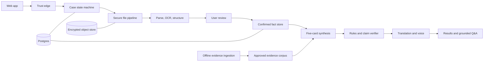

# Medical Report Explainer: Final Architecture

**Status:** Final buildathon decision  
**Date:** 15 August 2026  
**Detailed research:** [Model, safety, privacy, and architecture reference](./medical-report-explainer-architecture.md)

## 1. Product decision

Build a **medical report explainer**, not a diagnosis or treatment agent.

It will:

- extract facts from reports and prescriptions;
- explain those facts in simple language;
- compare compatible current and past results;
- restate instructions written by the doctor;
- cite the source page for every patient-specific statement;
- help the user prepare questions for a doctor.

It will not:

- diagnose, predict disease, or assess personal risk;
- recommend, start, stop, or change medicines or tests;
- invent prescription instructions;
- infer genetic risk from nationality, language, surname, caste, or location;
- interpret CT, MRI, X-ray, ultrasound, pathology, or other medical pixels;
- search the live internet with patient information.

## 2. Final user flow

1. **About you** — age, preferred language, optional symptoms and history, consent, and optional voice input.
2. **Upload** — up to ten PDFs or images, labelled as reports, current prescription, or past prescription.
3. **Review extracted facts** — confirm patient, dates, values, units, ranges, medicine names, doses, frequency, and duration. Critical uncertainty blocks analysis.
4. **Your report, explained** — five source-linked cards with calm, deterministic visuals.
5. **Ask questions** — grounded text Q&A; add push-to-talk only after the text path is stable.

The five result cards are fixed:

1. What these documents cover.
2. Important findings written in the reports.
3. What changed over time.
4. Instructions written by the doctor.
5. Questions for the next doctor visit.

## 3. Architecture



The central rule is **facts first, prose last**. Components exchange typed records, not unconstrained model-written text.

## 4. System layers

| Layer | Responsibility |
|---|---|
| 1. Experience | Input, uploads, review, source viewer, five cards, visuals, and Q&A |
| 2. Trust edge | Consent, age gate, authorization, rate limits, upload limits, and signed URLs |
| 3. Workflow | Explicit case states, jobs, retries, timeouts, and deletion |
| 4. Document intelligence | File sanitation, local parsing, OCR, layout, tables, and typed extraction |
| 5. Facts and evidence | Confirmed source-linked facts and an approved offline evidence corpus |
| 6. Explanation and safety | Synthesis, deterministic validation, claim verification, and localization |
| 7. Data and operations | Encrypted storage, audit, model versions, metrics, alerts, and retention |

## 5. Bounded agents and model routing

These are narrow services with fixed inputs and outputs. They do not plan freely or call arbitrary tools.

| Component | Final implementation | Output | Hard rule |
|---|---|---|---|
| Intake normalizer | Code; Sarvam Saaras v3 for voice | Confirmed transcript and language | User sees and confirms the transcript |
| Document extractor | Local PDF parser, then Sarvam Vision 1.5 when OCR is needed; GPT-5.6 Terra for strict structuring | Source spans, observations, and medication candidates | No tools or web access; document text is untrusted |
| Fact reconciler | Deterministic code; Terra only for terminology candidates | Duplicates, comparable results, conflicts, and review tasks | Preserve original text and values |
| Evidence retriever | Postgres full-text search plus `pgvector` | Reviewed evidence passages | Search only the approved internal corpus |
| Explanation synthesizer | GPT-5.6 Sol, medium reasoning | Exactly five cards and typed claims | Every claim must cite a fact or evidence passage |
| Safety verifier | Code plus a separate fresh GPT-5.6 Sol call | Supported, contradicted, insufficient, or unsafe | It rejects failed claims; it does not repair them silently |
| Localizer | Sarvam Translate, locked glossary, Terra back-check; Bulbul v2 for speech | One-to-one translations of verified claims | Names, medicines, doses, values, and units are protected tokens |
| Q&A agent | GPT-5.6 Terra; Sol only for conflicts | Concise answer, type, uncertainty, and citations | Case-scoped retrieval only; no external actions or live web |

Use one approved primary model provider in the live patient path. Benchmark Gemini 3.7 Flash and Claude Sonnet 5 offline on de-identified cases. Do not send each live case to several providers for voting. Do not silently fall back to an unevaluated model.

## 6. Workflow and failure behavior

```text
DRAFT → UPLOADED → SCANNED → EXTRACTED → NEEDS_REVIEW
      → CONFIRMED → ENRICHED → DRAFTED → VERIFIED → READY
```

Terminal or recoverable failure states:

```text
REJECTED_FILE · EXTRACTION_FAILED · SAFETY_FAILED · EXPIRED · DELETED
```

Each transition is idempotent. Persist the case ID, input hash, schema version, prompt version, pinned model ID, output hash, status, and token count. A retry must not duplicate a case or claim.

If OCR, synthesis, or verification fails, show a clear delayed or review-needed state. Never produce an unchecked answer to keep the flow moving.

## 7. Data contracts

The minimum source-of-truth entities are:

- `Case` and `ConsentRecord`;
- `Document`, `DocumentPage`, and `SourceSpan`;
- `Observation` and `MedicationInstruction`;
- `EvidencePassage`;
- `ClinicalClaim`;
- `AnalysisRun` and `SafetyFinding`;
- `ConversationTurn`.

Every confirmed fact stores:

- original text;
- normalized candidate, without replacing the original;
- value, unit, date, and printed reference range when applicable;
- document ID, page, bounding box, and text hash;
- extraction status and user-confirmation status.

Every displayed claim must satisfy one of these contracts:

```text
Patient claim   → one or more confirmed SourceSpan IDs
Education claim → one or more approved EvidencePassage IDs
No support      → omit the claim or return “cannot determine”
```

Keep identity separate from clinical case data. Do not send the user's name to models by default.

## 8. Evidence design

Run evidence ingestion outside the patient request path:

1. Fetch only approved sources such as MoHFW, ICMR, CDSCO, PvPI, and WHO.
2. Store publisher, title, date, jurisdiction, section, URL, hash, and review status.
3. Require clinician review before publication into the runtime corpus.
4. Version and expire superseded passages.
5. Retrieve only from this corpus during analysis and Q&A.

Population information can provide general education. It cannot establish a condition in an individual.

## 9. Safety and privacy invariants

- Use synthetic or fully de-identified documents during the buildathon.
- Reject mixed-patient uploads before merging facts.
- Require review of uncertain patient identity, date, decimal, value, unit, medicine, dose, frequency, and duration.
- Use the reference range printed by the reporting laboratory.
- Restate prescription instructions only when the doctor wrote them. Otherwise say “Not specified in the prescription.”
- Run numeric, unit, medication, citation, and prohibited-advice checks before display.
- Use clinician-authored emergency banner rules. An LLM is never the sole triage mechanism.
- Treat uploaded files and their text as untrusted. Scan and sanitize files in a network-disabled worker.
- Encrypt files and database data. Keep clinical text out of logs and analytics.
- Use short retention and an end-to-end deletion workflow.
- Do not use provider-managed conversation memory, hosted patient vector stores, or live web search.
- Do not accept DICOM in the MVP. A later version may extract a signed radiology report, never interpret pixels with a general model.
- Render range bars, trends, timelines, and medication cards with React/SVG. Do not generate patient-specific medical imagery.

Real patient data requires approved health-data contracts, retention controls, security review, clinical validation, and Indian legal and regulatory review.

## 10. API boundary

Keep the application API small:

```text
POST   /cases                         create case and consent record
POST   /cases/:id/uploads             upload through signed object-store URL
POST   /cases/:id/extraction          start idempotent extraction
GET    /cases/:id/review              get extracted fields and source regions
POST   /cases/:id/confirmation        confirm or correct critical fields
GET    /cases/:id/analysis            get state or verified five-card result
POST   /cases/:id/questions           ask a grounded question
DELETE /cases/:id                     delete the case and all clinical content
```

Every route must check case ownership. Workers receive short-lived, case-scoped access only.

## 11. Implementation stack

The working buildathon MVP is one Next.js and TypeScript application:

- signed anonymous sessions with same-origin and CSRF checks;
- Neon Postgres for durable Vercel workflow state;
- private Vercel Blob files uploaded with short-lived, case-scoped tokens;
- local SQLite and private local files as the development fallback;
- Sarvam Vision 1.5 document digitisation;
- GPT-5.6 Terra for strict extraction and Q&A;
- GPT-5.6 Sol for five-card synthesis and a separate safety check;
- Zod contracts at every model and API boundary;
- deterministic React range, timeline, prescription, and source views;
- direct official SDKs behind small provider adapters;
- synthetic or de-identified files only.

The buildathon deployment is restricted to synthetic or fully de-identified files. Before identified patient data, add an approved region, durable scheduled deletion, vendor health-data terms, audit trails, content-safe telemetry, clinical validation, and a security and legal review.

Do not add microservices, Kubernetes, Kafka, a graph database, or a general agent framework for the first version.

## 12. Buildathon scope

### Must ship

- English plus one clinically reviewed Indic language;
- PDF/JPEG/PNG upload with a fixed total page limit;
- local text extraction and Sarvam OCR fallback;
- critical-field review with source highlights;
- five verified source-linked cards;
- exact prescription restatement;
- deterministic range and timeline/medication visuals;
- grounded text Q&A;
- safe refusals and failure states;
- synthetic evaluation fixtures.

### Ship only after the vertical slice is stable

- voice input and spoken output;
- all four Indic languages;
- broader historical trend matching;
- accounts and long-term history.

### Out of scope

- real patient data at the event;
- diagnosis, treatment, autonomous triage, or drug-interaction advice;
- DICOM and medical-image interpretation;
- live patient-context web research;
- minors without verified guardian consent;
- generative medical imagery;
- multi-provider voting in production.

## 13. Release gates

Do not release a language or document type until its test set passes:

- 100% source coverage for patient-specific claims;
- zero unsupported diagnosis, treatment, dose change, or test-order claims;
- every critical medication and laboratory field is exact or blocked for review;
- 100% blocking of known mixed-patient cases;
- zero critical translation changes to negation, medicine, dose, value, unit, or frequency;
- 100% recall on the small clinician-approved emergency test set;
- zero successful document prompt-injection attacks;
- verified consent, access control, deletion, rollback, model pinning, and kill switch.

Track extraction accuracy, unsupported-claim rate, critical-error rate, review burden, latency, retry rate, and cost by language and document type.

## 14. Build order

1. Freeze schemas, safety wording, and 12 synthetic fixtures.
2. Build upload, sanitation, parsing, OCR, and source coordinates.
3. Build extracted-fact review and confirmation.
4. Build five-card synthesis and both verification gates.
5. Add source viewer, deterministic visuals, and grounded Q&A.
6. Add one Indic language with protected-token translation.
7. Test mixed patients, unreadable doses, decimals, prompt injection, outages, and deletion.
8. Add voice only if the complete text path is stable.

## 15. Final decisions

1. Explanation, not diagnosis.
2. Explicit workflow, not an autonomous agent swarm.
3. Confirmed facts are the source of truth.
4. User review is mandatory for critical uncertainty.
5. Every claim is traceable to a document or approved evidence.
6. One primary live model path; challengers compete offline.
7. Curated evidence replaces patient-context web search.
8. Deterministic visuals replace generated medical imagery.
9. DICOM pixels remain outside this product.
10. Synthetic data is the only buildathon data.
