# Vera: Final MVP Architecture

**Status:** Authoritative implementation decision

**Updated:** 16 August 2026

**Operational handoff:** [AGENT_HANDOFF.md](./AGENT_HANDOFF.md)

**Deep research:** [medical-report-explainer-architecture.md](./medical-report-explainer-architecture.md)

## 1. Product boundary

Vera is a mobile-first **medical report explainer** for adults using synthetic or fully de-identified documents.

Vera can:

- extract source-linked laboratory values and written prescription instructions;
- explain the documents in the selected language;
- compare compatible dated results;
- show calm, deterministic range and trend visuals;
- create one calm, text-free physiology illustration for a checked blood result;
- answer questions from the extracted document facts.

Vera cannot:

- diagnose, predict, triage, or assess personal risk;
- recommend tests or treatment;
- tell a user to start, stop, or change medicine;
- infer a condition from age, symptoms, history, nationality, or genetics;
- interpret DICOM, CT, MRI, X-ray, ultrasound, or pathology pixels;
- search the live web with patient context.

## 2. Shipped user flow

1. **About you** — preferred name, age, language, optional symptoms, and optional history.
2. **Your documents** — up to ten PDF, JPG, or PNG files, or the English synthetic sample.
3. **Your summary** — five short checked points, range/trend visuals, an optional picture explanation, and written prescription restatement.
4. **Follow-up questions** — grounded text or voice Q&A. Citations remain internal and are not shown in the simplified patient UI.

There is no manual field-by-field confirmation screen. The product is for people with low medical and digital literacy; making them validate every extracted parameter transfers the system's job to the user.

The code still uses `confirmed`, `NEEDS_REVIEW`, and `/confirmation` as internal workflow names. The live provider marks only facts that pass confidence, literal-source, field-window, and numeric checks as confirmed. The frontend then calls the internal confirmation route without changing those facts. This is a technical gate, not a claim that a person reviewed the facts. Rename it when the workflow is next refactored.

## 3. Current request path

```mermaid
flowchart LR
    UI[Next.js UI] --> SESSION[Basic access gate + anonymous session + CSRF]
    SESSION --> UPLOAD[Local private files or private Vercel Blob]
    UPLOAD --> OCR[Sarvam document digitisation]
    OCR --> EXTRACT[OpenAI structured extraction]
    EXTRACT --> CHECKS[Exact-excerpt and deterministic numeric checks]
    CHECKS --> ACCEPT[Internal auto-accept]
    ACCEPT --> DRAFT[OpenAI five-card synthesis]
    DRAFT --> VERIFY[Fresh OpenAI safety-verifier call]
    VERIFY --> CLEAN[Display sanitizer]
    CLEAN --> RESULT[Summary, visuals, and Q&A]
    RESULT --> IMAGE[Server-owned VisualSpec → GPT Image 2 → visual check]

    STATE[(SQLite locally / Neon on Vercel)] --- SESSION
    STATE --- ACCEPT
    STATE --- RESULT
```



The core rule is **facts first, prose last**. Models return Zod-validated structured data. Patient-specific output must refer to stored source spans.

## 4. Models and responsibilities

| Stage | Current implementation | Hard rule |
|---|---|---|
| OCR | Sarvam Document Intelligence for every uploaded PDF/JPG/PNG | OCR text is untrusted input; no instructions from a document may be followed |
| Fact extraction | `gpt-5.6-terra`, low reasoning, strict schema | Literal observations and written medicine instructions only |
| Synthesis | `gpt-5.6-sol`, medium reasoning, strict schema | Exactly five cards; no diagnosis, causes, prognosis, or treatment advice |
| Safety verification | A fresh `gpt-5.6-sol` call | Reject unsupported or unsafe drafts; never silently repair them |
| Q&A | `gpt-5.6-terra`, low reasoning | Use only case facts and the approved summary; return “cannot determine” when unsupported |
| Picture explanation | `gpt-image-2`, medium quality | Render only a server-owned, text-free physiology scene; never decide the medicine |
| Picture validation | `gpt-5.6-terra`, low reasoning with image input | Reject text, unrelated biology, diagnosis, damage, treatment, advice, or alarming content |
| Translation | No separate service | OpenAI writes directly in the selected language |
| Voice | Sarvam Saaras v3 STT and Bulbul v3 TTS | Turn-based input; transcript stays editable; audio never autoplays |

Model names can be changed with `OPENAI_EXTRACTION_MODEL`, `OPENAI_SYNTHESIS_MODEL`, and `OPENAI_QUESTION_MODEL`. Keep the defaults until a local evaluation proves another route is better.

The name is stored separately and is not sent to the model. Age, symptoms, and history are context only; prompts prohibit turning them into medical claims.

## 5. Deterministic controls

The current code:

- validates actual file bytes for PDF, JPEG, or PNG;
- limits each file to 10 MB and each case to 10 files;
- limits OCR text to 160,000 characters;
- accepts only extraction excerpts that occur on the stated OCR page;
- recomputes a numeric high/low/normal flag when a parseable two-number range exists;
- validates all model and API payloads with Zod;
- verifies that all cited span IDs exist;
- requires citations on document-fact answers;
- strips leaked `span_UUID` values and simple Markdown from displayed text;
- creates exact range bars and timelines in React;
- selects one confirmed, non-review observation with deterministic code before image generation;
- keeps values, ranges, names, dates, medicines, and localized copy out of generated artwork and in accessible HTML;
- keeps all API responses private with `Cache-Control: no-store`.

Current limits are not a production clinical validation system. Extraction confidence is enforced but not persisted for audit, mixed-patient uploads are not detected, live source boxes are placeholders, and files are not malware-scanned or structurally sanitized.

## 6. State and storage

The effective state path is:

```text
DRAFT → UPLOADED → EXTRACTING → NEEDS_REVIEW → CONFIRMED → READY
```

`UPLOADED` is skipped for the synthetic sample. `NEEDS_REVIEW` and `CONFIRMED` are hidden internal names. `VERIFIED` exists in the type but is not persisted as a separate step. Recoverable failure states are `EXTRACTION_FAILED` and `SAFETY_FAILED`.

| Environment | Case state | Files |
|---|---|---|
| Local | Node SQLite in `.data/mvp.sqlite` | private files in `.data/uploads` |
| Vercel | Neon Postgres | private Vercel Blob |

Do not add Convex. The current Postgres and Blob split is simple and sufficient for this MVP.

The schema is created lazily by the application. It stores sessions, cases, a separate identity row, uploads, and conversation turns. There is no account or case list. The current tab keeps one active case ID in `sessionStorage` and can resume that temporary case after refresh while the session and case remain valid.

## 7. Auth, privacy, and retention

There are two separate controls:

1. `MVP_ACCESS_CODE` enables an HTTP Basic access gate for the whole deployment. The username is `vera`. This is a buildathon gate, not end-user authentication.
2. Each browser receives an opaque httpOnly session cookie. Mutations require same-origin requests and a session-derived CSRF token.

Production fails closed when the access code, Postgres, or Blob configuration is missing. `ALLOW_UNPROTECTED_MVP=true` is an explicit emergency override and should remain unset.

Sessions and cases have a 24-hour absolute lifetime and a 30-minute idle lifetime. Cleanup is opportunistic: it runs when session endpoints are used, not from a durable scheduled job. “Delete case and start over” deletes the database case and its stored files immediately when the request succeeds.

The buildathon must use only synthetic or fully de-identified files. Real patient data needs vendor health-data terms, durable deletion, audit controls, clinical validation, and Indian security, privacy, legal, and regulatory review.

## 8. API boundary

```text
GET    /api/health
GET    /api/session
POST   /api/cases
POST   /api/cases/:id/uploads/token   Vercel Blob token
POST   /api/cases/:id/uploads         local upload or Blob finalization
GET    /api/cases/:id/uploads/:uploadId
POST   /api/cases/:id/extract
POST   /api/cases/:id/confirmation    internal auto-accept + synthesis
POST   /api/cases/:id/questions
POST   /api/cases/:id/speech/transcribe
POST   /api/cases/:id/speech/synthesize
POST   /api/cases/:id/visual-explanation
POST   /api/speech/transcribe          intake voice input
GET    /api/cases/:id
DELETE /api/cases/:id
```

Every case route checks ownership through the anonymous session. Current abuse guards allow 25 active cases per browser session and 20 questions per case.

## 9. Deliberate exclusions

- No autonomous agent framework or swarm.
- No Convex, microservices, queue, Kubernetes, Kafka, or graph database.
- No live patient-context internet research.
- No approved external evidence corpus yet.
- No DICOM or diagnostic-image interpretation.
- No generated depiction of patient anatomy, pathology, diagnosis, treatment, or improvement.
- No full-duplex or phone-style voice conversation.
- No user accounts or long-term history.
- No real patient data in this buildathon version.

## 10. Next architecture gates

Before any real-patient pilot:

1. Build a de-identified, clinician-labeled evaluation set by language and report type.
2. Persist safe extraction-confidence audit metadata and expand deterministic rejection tests; do not reintroduce a checkbox for every value.
3. Detect mixed-patient uploads and inconsistent dates, units, decimals, doses, and identities.
4. Add real document sanitation, malware scanning, reliable page coordinates, and source-region viewing.
5. Add durable scheduled deletion, PHI-safe telemetry, provider latency metrics, retries, and a kill switch.
6. Run native-language and clinical review of every localized UI, safety, speech, and generated-picture string.
7. Tighten Q&A length and multilingual boundary tests.
8. Add a curated, versioned, clinician-reviewed evidence corpus only if general education is required.
9. Complete clinical, security, privacy, legal, and medical-device review.

## 11. Final decisions

1. Explain documents; do not diagnose or advise.
2. Keep one explicit workflow; do not build a general autonomous agent.
3. Keep document facts and source spans as the source of truth.
4. Verify internally; do not make low-literacy users approve every extracted field.
5. Preserve the current confidence and source checks; omit or block uncertain critical facts.
6. Keep one primary live provider path; evaluate alternatives offline.
7. Keep exact medical facts in deterministic UI. Use generated imagery only as a checked, supplemental physiology explanation.
8. Keep DICOM pixels, live web research, and real patient data out of the MVP.
